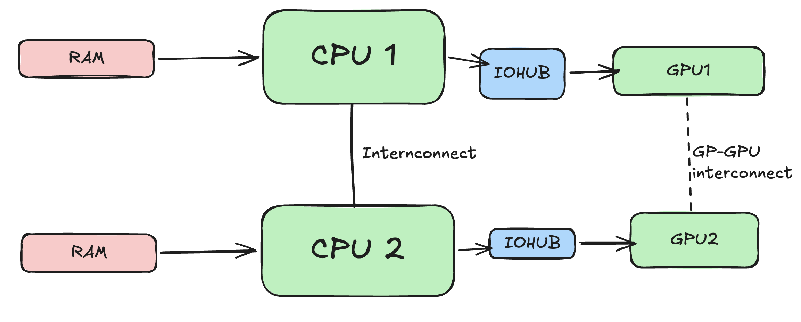
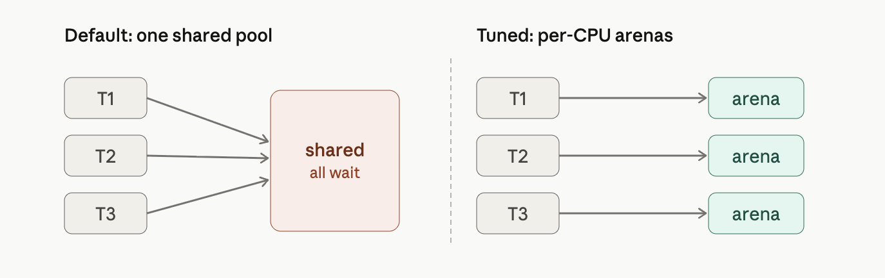

# Introduction
This part is mainly for my own understanding of GPU topics and topics which I come across. This is in no way shape or form complete or comprehensive list of topics for GPU optimization techniques and theories

## OS, Docker and kubernetes for GPU
Even with high end gpus, performance can be bottlenecked by OS, CPU, memory. The fastest gpu is only as good as the data feeding it. 

### CPU and operating system settings
For operating system, an important parameter is swapiness, this determines if OS will pull the pages from RAM to slower hard drive based swap space. Keeping `vm.swapiness=0` prevents swapping to take place and keeps the data in RAM (until its full of course). 

Cuda driver interfaces with the actual device and the cuda driver interacts with the GPU to enable its features

```{mermaid}
%%| eval: true
%%| fig-cap: "Cuda Toolkit and Cuda driver"
flowchart LR
    Toolkit["Cuda Toolkit (runtime, libararies)"] --> Driver["Cuda Driver (libcuda.so)"]
    Driver["Cuda Driver (libcuda.so)"] --> Kernel["Kernel mode nvidia.ko"]
    Kernel --> GPU
```

GPU programming model is compatible across different generations of hardware. This allows JIT compilation for GPUs so that their code can run on the newer hardware. 

{#fig-architecture fig-alt="Cuda compile time architecture (Intermediate)"}
When compiling cuda code, you produce CUBIN and PTX
Now PTX is just an intermediate representation which can be used by CUDA to compile (JIT) older programs to the 
newer GPU. CUBIN is the architecture level SASS (Streaming assembler) which is needed for a specific architecture you are compiling for today.

CUBIN is fast to load but locked for specific GPU, whereas PTX code is forward compatible. A FAT Binary or Fatbin just bundles both of them together and you need to ship both for it to be compatible.

### Frameworks
Many python based frameworks like pytorch and keras are build on top of CUDA. 
The PyTorch compiler stack consists of TorchDynamo, AOT Autograd, and
a backend like TorchInductor or Accelerated Linear Algebra (XLA), which
automatically capture and optimize your models. TorchInductor is the most
common backend, and it uses OpenAI’s Triton under the hood. 

{fig-architecture fig-alt="Pytorch compilation for cuda"}

While performing matrix multiplications, PyTorch delegates these tasks to libraries 
such as cuBLAS. cuBLAS is part of the CUDA Toolkit and optimized for GPU execution. Behind the 
scenes, PyTorch ensures that operations like forward and backward passes are executed using 
low-level, optimized CUDA functions and libraries.

## CPU affinity and NUMA (Non unified memory architecture)
In many cases, GPU sits idle because either OS is scheduled poorly or CPU can't feed the data fast
enough to GPU. Some of the optimizations include setting CPU affinity to avoid cross numa node traffic.
Example if the GPU running on node 1 requires data from CPU which runs on node 0 it needs transfer data
across internode link which can contribute to latency.



For running a training process on a CPU core, each CPU process should be `Pinned` based on its affinity to the GPU. `numactl` provides a way to bind processes based on its affinity.

```bash
numactl --cpunodebind=1 --membind=1 \
python train.py --gpu 4
```

If numa affinity is not known, `nvidia-smi topo` can be used to both find affinity and bind cpu processes

```bash
#!/bin/bash
for GPU in 0 1 2 3; do
  # Query NUMA node for this GPU
  NODE=$(nvidia-smi topo -m -i $GPU \
        | awk '/NUMA Affinity/ {print $NF}')
  # Launch the training process pinned to that NUMA node
  numactl --cpunodebind=$NODE --membind=$NODE \
        bash -c "CUDA_VISIBLE_DEVICES=$GPU python train.py --gpu $GPU"
done
```

`pin_memory=True` and use `non_blocking=True` to page-lock those buffers so that the host 
(CPU) cannot swap it to slower memory.

It’s important to note that the OS has a limit on how much memory a user
can lock (pin). This is set with the ulimit -l <max locked
memory> command. In containerized environments, you can adjust the
container’s security context and Docker --ulimit memlock setting
accordingly. This way, the container can lock sufficient memory.

A DMA (Direct Memory Access) engine is dedicated hardware whose entire job is shoveling bytes between two addresses. The CPU just writes a small descriptor — source address, destination address, length — kicks the engine off, and goes back to other work. The engine streams the data across the bus on its own and raises an interrupt when it's done. These engines live all over a system: in the PCIe root complex, inside NICs, inside NVMe controllers, and inside GPUs (NVIDIA calls the GPU's versions copy engines). When you cudaMemcpy from pinned host memory to the GPU, it's the GPU's copy engine reading your RAM over PCIe by DMA.
The catch : a DMA engine works with physical addresses and streams autonomously, so the source pages must stay put — they can't be swapped out or relocated mid-transfer.

RDMA is that same idea stretched across a network. An RDMA-capable NIC on machine A can write straight into a specific memory region on machine B — without the remote CPU touching the data, and without either side going through the kernel's TCP/IP stack. The app registers a memory region, posts a work request to the NIC's queue, and the NIC's DMA engine carries out the transfer end to end. Three properties make it fast: kernel bypass (the app talks to the NIC directly), zero-copy (no bouncing through OS buffers), and CPU offload (the remote CPU is never interrupted to handle the data). InfiniBand, RoCE, and iWARP are the common flavors. GPUDirect RDMA from your passage is exactly this, with the endpoint being GPU memory instead of host RAM: the NIC DMAs across the wire directly into another box's GPU, skipping both hosts entirely.

### HugePages and memory Allocator
THP -> Can help in reducing the memory overhead by making memory chunks bigger, TLB (Translation lookaside buffer)
maps this virtual address to the pyhsical address in the memory. Larger hugepages means TLB has to spend less time
finding the page. However for inference workloads where data can vary if memory becomes full or near full, compaction takes places which reshuffles memory blocks and can harm the performance. General consensus is to disable THP for inference or us `madvise` to only have THP for certain cases (KV cache or matrices)


jemalloc and tcmalloc are smarter replacement allocators that attack exactly these. Every knob in your passage does one of two simple things:
Give each thread/CPU its own private stash so nobody waits in line. In jemalloc, narenas:8 splits the one pool into eight separate ones (the right side of the picture above). 

In tcmalloc, TCMALLOC_MAX_TOTAL_THREAD_CACHE_BYTES=512MB makes each thread's personal cache bigger, so small allocations get served right out of that local cache without touching the shared lock or the OS at all.
Hold onto freed memory and reuse it instead of bouncing it back to the OS. In jemalloc, the long dirty_decay_ms/muzzy_decay_ms (10000 ms = 10 seconds) tell it "don't rush to return freed pages — keep them around to reuse," which cuts those slow OS trips. tcmalloc's TCMALLOC_RELEASE_RATE is the same dial: it sets how eagerly free memory goes back to the OS, so you tune it to return excess without churning. And jemalloc's background_thread:true moves the cleanup work (returning/purging old pages) onto a side helper thread, so it happens off to the side instead of in the middle of your batch-prep, where it would cause a pause.


## GPU Driver and runtime optimization
Some GPU driver settings to improve and boot performance

Keep GPU running as initializing a GPU can incur additional overhead. `nvidia-persistenced` keeps driver loaded and running even when no application is using the GPU (Higher power draw)

### MPS (Multi Process Service)
When multiple processes share one GPU, the scheduler time-slices between them—running one process's kernel, then another's. With short kernels and idle gaps in between, the GPU wastes time on "ping-pong" context switches and underutilizes its resources.
NVIDIA's MPS lets multiple processes run on the GPU concurrently instead of strictly time-slicing. It merges their contexts into a single scheduler context, so the GPU can execute kernels from different processes simultaneously whenever resources (SMs, Tensor Cores, etc.) are free—avoiding the cost of switching and idling between processes.
When is it useful? Not so much for training, where you typically run one process per GPU. But it's a game changer for running many inference jobs on one large GPU. For example, four inference jobs on a 40 GB GPU, each using 5–10 GB and only ~30% of compute: by default each gets a time-slice, so only one runs at a time, leaving the GPU ~70% idle on average. MPS lets them run concurrently and reclaim that idle capacity.

