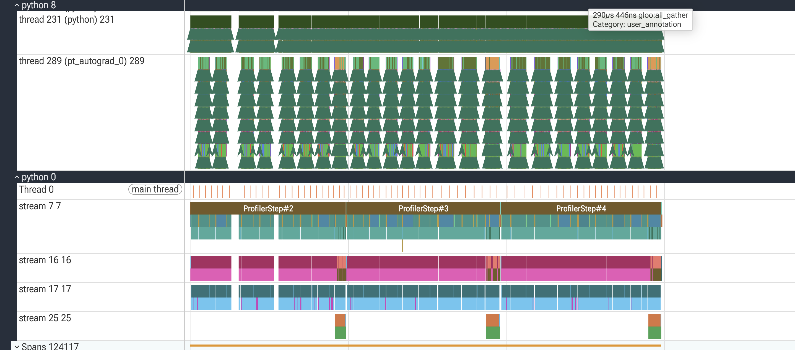

## Introduction

These are my notes from fine-tuning [SmolLM3-3B](https://huggingface.co/HuggingFaceTB/SmolLM3-3B)
on a medical Q&A dataset across two GPUs using **FSDP** (Fully Sharded Data
Parallel). The goal was practical: understand what FSDP actually does to memory,
why it's *necessary* here rather than optional, and what breaks along the way.

The motivating constraint is concrete. A 3B model sounds small — 6 GB of weights
in bf16 — so surely it trains on any modern GPU. It doesn't. On the A100-40GB I
was running, the naive full-replica approach doesn't fit at all. FSDP is what makes
this model trainable on that hardware, and understanding *why* is the whole point.

::: {.callout-note}
## What this post is
The reasoning and the gotchas behind one real FSDP run, using Hugging Face's
`Trainer` / TRL `SFTTrainer` where FSDP is configured rather than hand-written.
Code lives at the end.
:::

## Why the model doesn't fit: where the memory goes

The intuition that trips people up: parameter count barely predicts training
memory. The weights are the *small* part. Everything around them — gradients and,
above all, the optimizer state — is what fills the GPU.

For a model with $P$ parameters trained with Adam in mixed precision, the *static*
per-GPU cost — present before a single activation — looks like this:

| Component | Precision | Bytes/param | For 3B |
|-----------|-----------|-------------|--------|
| Weights | bf16 | 2 | ~6 GB |
| Gradients | bf16 | 2 | ~6 GB |
| Adam moment `m` | fp32 | 4 | ~12 GB |
| Adam variance `v` | fp32 | 4 | ~12 GB |
| **Static total** | | **~12** | **~36 GB** |

Activations sit on top of that (gradient checkpointing keeps them small). So the
*real* number to plan around is ~36–42 GB, not 6 GB.

```{python}
#| label: memory-model
#| code-fold: show

def static_memory_gb(params_billion, num_gpus=1, sharded=False):
    """Rough per-GPU static training memory (weights + grads + Adam), mixed precision."""
    P = params_billion * 1e9
    weights = 2 * P      # bf16
    grads   = 2 * P      # bf16
    adam    = 8 * P      # fp32 m + fp32 v
    total_bytes = weights + grads + adam
    if sharded:
        total_bytes /= num_gpus   # FSDP: sharded across ranks
    return total_bytes / 1e9

print(f"full replica, 1 GPU: ~{static_memory_gb(3):.0f} GB")
print(f"FSDP sharded, 2 GPU: ~{static_memory_gb(3, num_gpus=2, sharded=True):.0f} GB")
```

### Why this rules out a single-GPU full replica

That ~36–42 GB peak lands right on top of a 40 GB card's ceiling — no room for
activations, CUDA context, or NCCL buffers. In practice it OOMs. The table shows
how tight it is:

| GPU | VRAM | Full replica (~40 GB peak) | FSDP sharded / 2 GPU (~18 GB) |
|-----|------|----------------------------|-------------------------------|
| A10G | 24 GB | ❌ OOM | ✅ |
| A100 40 GB | 40 GB | ❌ OOM / knife-edge | ✅ |
| L40S | 48 GB | ✅ (small headroom) | ✅ |
| A100 80 GB | 80 GB | ✅ comfortable | ✅ |

::: {.callout-warning}
## Batch size is the wrong lever
When you OOM, the reflex is to drop the batch size. But batch size only scales
*activation* memory — the small part, especially with gradient checkpointing on.
The ~36 GB of weights + grads + optimizer state doesn't move. If the static cost
doesn't fit, **sharding is the fix, not a smaller batch.**
:::

## What FSDP does about it

FSDP's core idea: don't keep a full copy of the model on every GPU. Partition the
weights, gradients, and optimizer state across the ranks, and reconstruct each
layer's full weights *just in time* for the forward and backward pass, then throw
them away again.

```{mermaid}
%%| eval: true
%%| fig-cap: "FSDP: parameters live sharded, gathered per-layer on demand"
flowchart TB
    B1[Shard 0<br/>GPU 0] -- all-gather weights --> B3[Full layer<br/>forward / backward]
    B2[Shard 1<br/>GPU 1] -- all-gather weights --> B3
    B3 -- reduce-scatter grads --> B1
    B3 -- reduce-scatter grads --> B2
```

Concretely, per training step FSDP:

1. **All-gathers** each layer's sharded weights into the full layer, right before
   it's needed.
2. Runs forward / backward on the full layer, then **frees** the gathered weights.
3. **Reduce-scatters** the gradients back down to shards.
4. Keeps only its shard of the optimizer state.

The result on 2 GPUs: that ~36 GB static cost becomes ~18 GB per GPU. The price is
communication — the all-gathers and reduce-scatters are extra traffic every step.
That's the fundamental FSDP trade: **communication in exchange for memory.** When
the model won't fit otherwise, it's a trade you happily take, because the
alternative is not training at all.

## Configuring FSDP with the HF Trainer

The relevant switch in `SFTConfig` / `TrainingArguments`:

```{python}
#| label: fsdp-config
#| code-fold: show

fsdp_arg = "full_shard auto_wrap"
fsdp_config = {
    # Force FSDP1 (flat params) instead of FSDP2 (DTensor). See gotcha #1 below.
    "fsdp_version": 1,
    # Wrap at the model's actual decoder-layer class -- NOT "LlamaDecoderLayer".
    # Auto-wrap needs the right class name to find shard boundaries.
    "fsdp_transformer_layer_cls_to_wrap": ["SmolLM3DecoderLayer"],
    "fsdp_backward_prefetch": "backward_pre",   # overlap comms with compute
    "fsdp_state_dict_type": "SHARDED_STATE_DICT",
    "fsdp_offload_params": False,               # True if you're still OOMing
}
```

Two details that matter more than they look:

1. **The wrap class must be exact.** For SmolLM3 it's `SmolLM3DecoderLayer`, not the
   Llama name you might copy from a tutorial. Get it wrong and auto-wrap can't find
   layer boundaries to shard at — you silently lose most of the memory savings.
2. **`fsdp_offload_params=True`** is your escape hatch if even sharded params don't
   fit — it pushes them to CPU RAM at a throughput cost. The last resort before
   "get a bigger GPU."

## The gotchas (this is the useful part)

Getting FSDP *configured* was easy. Getting a run to actually finish surfaced three
failures that no tutorial warned me about. Each looked scary and had a one-line fix.

### Gotcha 1 — FSDP2's DTensor error after the first eval

The run trained cleanly for ~100 steps, ran a full eval, then died:

```
RuntimeError: aten.embedding.default: got mixed torch.Tensor and DTensor,
need to convert all torch.Tensor to DTensor before calling distributed operators!
```

Modern FSDP (**FSDP2**, `fully_shard`) represents sharded params as `DTensor`. Some
params — notably tied embeddings — can end up as plain `torch.Tensor` while the
rest are `DTensor`, and the *next* forward after an eval/checkpoint cycle mixes the
two. It characteristically fires right after the first eval, which is why it ran
fine for 100 steps first.

::: {.callout-tip}
## Fix
Pin FSDP1: `"fsdp_version": 1`. FSDP1 uses flat parameters, not `DTensor`, so the
mixed-tensor path can't occur. (Tracked upstream in
[transformers #42417](https://github.com/huggingface/transformers/issues/42417)
and [pytorch #153354](https://github.com/pytorch/pytorch/issues/153354).)
:::

### Gotcha 2 — checkpoint save fills the disk and truncates

With FSDP1 in place, the run then crashed at the first checkpoint save:

```
save_fsdp_optimizer → dist_cp.save → torch.save → write_end_of_file()
RuntimeError: [enforce fail at inline_container.cc:626] . unexpected pos 448 vs 342
```

That `unexpected pos` from torch's `inline_container` is a **truncated write** — the
file write failed partway. The cause: an FSDP checkpoint saves weights *plus* the
full fp32 Adam state (~30 GB+ for 3B), and that overflowed the container's ephemeral
disk on the first save. Ironically, the same optimizer state that forces you to use
FSDP is also what blows up the checkpoint.

::: {.callout-tip}
## Fix
If you only want the final model, stop periodic checkpoints entirely:
`save_strategy="no"`. The explicit `save_model()` + `push_to_hub()` at the end still
run. For crash-resilient long runs, instead mount a large **volume** at
`output_dir` so there's real disk to write to.
:::

### Gotcha 3 — metrics logged to the wrong place

Training metrics weren't showing on the dashboard. The logs revealed *two* separate
experiment-tracker sessions: a manual `init()` that got closed before training, and
the `Trainer`'s built-in callback — which does its own `init()` and reads its target
from **environment variables**, defaulting to a *local* directory inside the
container that's discarded when the job ends.

::: {.callout-tip}
## Fix
Don't hand-roll a second tracker session. Set the env vars the callback actually
reads (e.g. `TRACKIO_PROJECT`, `TRACKIO_SPACE_ID`) *before* the `Trainer` starts,
and let the single built-in callback own logging.
:::

::: {.callout-note}
## The pattern across all three
None of these were FSDP "not working." They were interactions at the seams —
FSDP × eval, FSDP × disk, `Trainer` × tracker. Distributed training is mostly
debugging the seams, and the logs told the exact story every time. Read them
top-to-bottom before changing config.
:::

## Benchmarking the FSDP run

The training script exposes a benchmark mode: cap the run to a fixed number of
steps, log every step, skip the model push, and capture a `torch.profiler` trace.

```bash
# FSDP timed run with profiler
TRAIN_STRATEGY=fsdp BENCHMARK_STEPS=10 ENABLE_PROFILER=true \
    modal run --detach launch_on_modal.py --script "launch_command.sh"
```

```{python}
#| label: fsdp-throughput
#| eval: false
#| fig-cap: "FSDP throughput and per-GPU memory — fill from your own profiler run"

import pandas as pd
import plotly.graph_objects as go
from plotly.subplots import make_subplots

# NOTE: placeholder values. Replace with numbers from your BENCHMARK run
# (trainer metrics: train_samples_per_second, train_steps_per_second; and
# peak per-GPU memory from the profiler trace).
bench = pd.DataFrame({
    "Metric": ["Peak mem / GPU (GB)", "Samples / sec", "Steps / sec"],
    "FSDP":   [None, None, None],
})

fig = go.Figure(go.Bar(x=bench["Metric"], y=bench["FSDP"],
                       marker_color="#27AE60"))
fig.update_layout(height=350, margin=dict(t=40, b=40, l=60, r=40),
                  title_text="FSDP run summary")
fig.show()
```

::: {.callout-warning}
## Honesty note
The chart above is intentionally empty — I'd rather ship a template than invented
numbers. Drop in your own `train_samples_per_second` and the profiler's peak-memory
figure once the benchmark run completes.
:::

### Reading the profiler trace

Here's what the actual FSDP trace from this run looks like, loaded in Perfetto:
 
{#fig-trace fig-alt="PyTorch profiler trace showing a python thread, a pt_autograd backward thread with repeated sawtooth patterns, and several CUDA streams (7, 16, 17, 25) densely filled across ProfilerStep#2, #3 and #4"}
 
Reading it top to bottom:
 
- **`thread 231 (python)`** — the main Python thread dispatching work. The long
  green blocks are the framework driving the step; the early gap at the far left is
  warmup settling before the profiler's `active` window.
- **`thread 289 (pt_autograd_0)`** — the autograd (backward) thread. Those repeated
  **sawtooth / "tree" shapes are the per-decoder-layer work** — one repeated unit
  per wrapped `SmolLM3DecoderLayer`. That regular, repeating structure is exactly
  what you want to see: it means auto-wrap sharded at layer granularity as
  configured, so each layer is gathered → computed → freed in a tidy cycle.
- **`Thread 0 (main thread)`** — the thin orange tick marks are CUDA kernel
  *launches* from the host. They're evenly spaced, i.e. the CPU is feeding the GPU
  steadily and isn't stalling.
- **CUDA stream `7`** — the main compute stream. This is where the actual
  matmuls/attention kernels for the forward and backward pass run.
- **CUDA stream `16`** — the NCCL *execution* stream. Slices here are named things
  like `ncclDevKernel_AllGather_RING_LL(...)` with `Category: kernel` — this is the
  literal collective communication kernel moving bytes between GPUs.
- **CUDA stream `17`** — the FSDP *annotation* stream. Slices here are named
  `FSDP::all_gather (model.layers.N)` with `Category: gpu_user_annotation` — a
  profiler-inserted label wrapping the all-gather operation for a specific layer,
  useful for seeing *which layer* a given burst of comms belongs to.
- **`ProfilerStep#2/#3/#4`** label the three steps captured by the schedule
  (`wait=1, warmup=1, active=3`).
The important read: **streams 7, 16 and 17 are near-continuously filled with
almost no white gaps** — the GPU is busy end to end, and compute overlaps with the
communication streams rather than stalling on it. That's
`backward_prefetch="backward_pre"` doing its job.
 
::: {.callout-tip}
## Why you'll see two all-gathers overlapping, not one at a time
Zoom into stream 17 and you'll often catch two adjacent `FSDP::all_gather` regions
for *different* layers sitting close together — e.g. `model.layers.21` and
`model.layers.23` back-to-back rather than cleanly sequential. That's prefetch,
not a bug or duplicate work:
 
1. While GPU 0 is computing **layer 21's** forward/backward pass on stream 7, FSDP
   simultaneously kicks off the all-gather for **layer 23's** weights on streams
   16/17, in the background.
2. Because the all-gather runs on a separate stream, its network communication
   overlaps with layer 21's matmuls instead of blocking them.
3. By the time layer 21's compute finishes, layer 23's full weights are already
   sitting there — so compute can move straight into layer 23 with no wait.
Worked example with 2 GPUs and 4 layers, each layer's weights split in half
across the two ranks:
 
| Layer | GPU 0 holds | GPU 1 holds |
|-------|-------------|-------------|
| 1 | half of Layer 1 | other half |
| 2 | half of Layer 2 | other half |
| 3 | half of Layer 3 | other half |
| 4 | half of Layer 4 | other half |
 
Neither GPU alone has enough of any single layer to compute with — that's the
memory saving. The naive approach (gather → compute → reshard → gather → compute
→ …, one layer at a time, fully serial) would stall compute on every layer's
network round-trip. Prefetching hides that cost: the all-gather for layer *N+1*
is issued while layer *N* is still computing, so by the time layer *N* finishes,
layer *N+1*'s weights are ready. Over a full step you'll also see this happen
twice per layer — once before forward, once before backward — since FSDP
reshards after forward to keep the memory savings, then has to re-gather before
backward needs the full weights again.
:::
 
::: {.callout-note}
## What's healthy here
The two signals that say this run is *compute-bound, not communication-bound*:
(1) the CUDA streams have very little idle white space, and (2) the per-layer
sawtooth in the autograd thread is regular — no long flat stretches where a rank
is waiting on an all-gather. On 2 GPUs with layer-wrapped FSDP and prefetch on,
that's the outcome you're aiming for.
:::
 
::: {.callout-warning}
## Where the bottleneck would show up
This zoomed-out view can hide things a kernel-level zoom would reveal. To confirm
communication isn't the limiter, zoom into a single `ProfilerStep` and look for:
 
- **Gaps on stream 7 (compute)** that line up with active `ncclDevKernel_AllGather`
  slices on stream 16 → comms not overlapping; try tuning prefetch or
  `limit_all_gathers`.
- **`stream 25`**, which fires only in short bursts at the step boundaries here —
  likely the boundary collective (e.g. gradient reduction / optimizer step). If
  those bursts grow relative to the step, the sync at the boundary is your cost.
- The **sparse orange band at the very start** — warmup/setup, correctly excluded
  from the `active` measurement window.
For this run, none of those dominate — the story is a well-overlapped,
compute-bound FSDP step.
:::

## Recommendations

```{mermaid}
%%| eval: true
%%| fig-cap: "Does FSDP fit?"
flowchart TD
    Start[Model + Adam state<br/>too big for one GPU?] -->|Yes| Fit[Fits when sharded<br/>across your GPUs?]
    Fit -->|Yes| FSDP[FSDP full_shard]
    Fit -->|No| Offload[FSDP + CPU param offload<br/>or a bigger / more GPUs]
```

1. **Reach for FSDP `full_shard`** when the model + optimizer state won't fit as a
   full replica. It divides the static memory by the number of GPUs.
2. **Wrap at the correct decoder-layer class** — the single most common way to
   silently lose the savings.
3. **Turn on `fsdp_offload_params=True`** if sharding alone isn't enough. It trades
   speed for headroom.
4. **Pin `fsdp_version: 1`** until the FSDP2/DTensor + eval interaction is resolved
   in your stack.

## Lessons learned

::: {.callout-note}
## Key takeaways
1. **Parameter count lies about training memory.** A 3B model needs ~36 GB of
   *static* state under Adam. Plan for weights + grads + 2× fp32 optimizer state,
   not just weights.
2. **FSDP trades communication for memory.** That's the whole deal — it shards the
   state so a model that can't fit as a replica becomes trainable.
3. **Sharding, not batch size, is the memory lever.** Batch size only touches
   activations.
4. **The failures are at the seams.** FSDP × eval, FSDP × disk, `Trainer` ×
   tracker. Read the traceback fully; each of mine had a one-line fix.
5. **A bigger GPU isn't always more memory.** A100-40GB < L40S-48GB. Check the
   actual VRAM, not the model name.
:::

## Appendix: reproduction

Code, launch scripts, and configuration:

<https://github.com/vinayhpandya/distributed_machine_learning_practice>

```bash
# FSDP fine-tune, detached so it survives a closed terminal
TRAIN_STRATEGY=fsdp modal run --detach launch_on_modal.py --script "launch_command.sh"

# Follow logs / check status
modal app logs smolm-medical-training
```

---

*Notes from a distributed-training practice project. Corrections welcome.*
