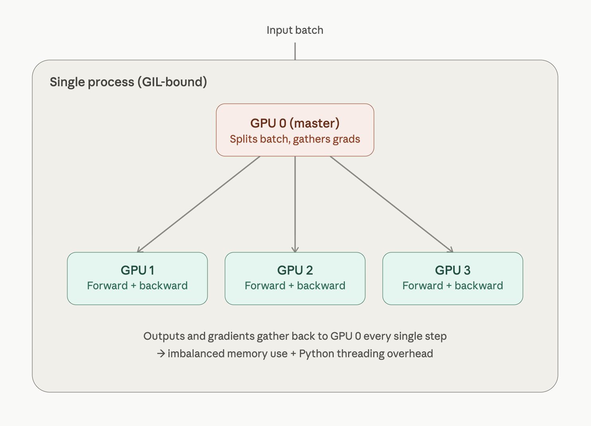
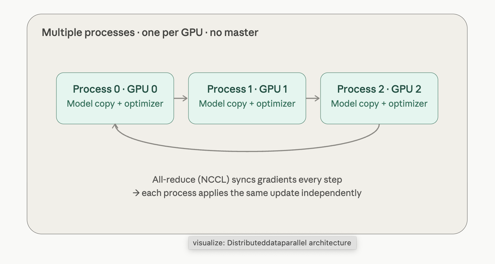
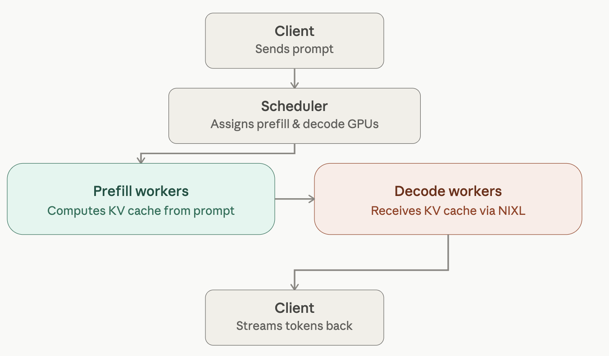

## Introduction
This chapter consists of nvidia's magnum IO (NIXL, GPUDirectRDMA, nccl), also some tips and tricks to keep GPU active by overlapping computation and communication, Disaggregated inference using NIXL. We will also deep dive into some of the more intricacies related to NVLINK, GDS and nvme. Performance engineers need to carefully tune the network and storage fabric to allow high level of GPU utilization

## Overlapping computation and communication
Data transfers should occur concurrently with ongoing computations (pipelining) in order to use GPU efficiently. Pytorch allows asynchronous communication so that if one layer of neural network is finished with its computation the next batch is ready. 

Cuda uses cuda streams where one stream can compute matrix multiplications and the other streams can work on communication and other primitives. Gradient accumulation helps in performing more computation thereby increasing the amount of computation performed between communication events. The less communication events the better since this helps in keeping GPU occupied and improves throughput.

Compression hjelps in reducing the amount of data to be sent during communication. Although this does not help in reducing the number of communication events, it helps in completing the events faster.

The naive way would be one all-reduce per parameter tensor, fired the moment that tensor's gradient is ready. That's terrible for throughput for two reasons. First, collectives have a fixed per-call latency/launch overhead, and they only approach peak interconnect bandwidth on large contiguous buffers — so thousands of tiny all-reduces leave you latency-bound and bandwidth-starved. Second, doing them naively tends to serialize: compute the whole backward, then communicate.
Bucketing fixes both. DDP groups parameters into buckets (default bucket_cap_mb = 25 MB). As gradients are produced during backward, they're copied into a bucket's contiguous buffer; when a bucket is completely filled, DDP launches a single all-reduce for that whole bucket. Two wins come out of this:

Fewer, larger collectives → the fixed latency is amortized and the interconnect runs near peak bandwidth.
Communication/computation overlap → because backward produces gradients for the last layers first, the earliest buckets fill while the rest of the backward is still running. DDP kicks off the all-reduce for a ready bucket concurrently with the ongoing backward compute. The communication hides behind computation instead of running after it.

## Async execution with cuda streams
One stream can handle compute kernels such as matrix multiplies, while another stream handles communication such as data copies and all-reduce calls. By assigning work to different streams and using nonblocking operations, communication can happen in the background.

Pytorch hides this complexity. During DDP (distributed data parallel), it automatically installs hooks on backward pass such that each gradient bucket triggers a NCCL all reduce on a cuda stream. For proper syncronization avoid `torch.Tensor.item()` and `torch.cuda.synchronize`

## Gradient Accumulation
Instead of updating model weights after every pass, the gradients are computed and summed across micro batches allowing for a massive batch size on a GPU with fewer communication events (nccl all_reduce or sum). Consider 4 minibatches within an epoch, the communication frequency would be cut by 4 during each training run (one epoch)

Bucketizing gradients helps in grouping many small gradients together, once the bucket becomes full the all_reduce synchronization can take place. However, bucket sizing is a trade-off. Very large buckets maximize bandwidth utilization but delay the start of communication since you wait for more gradients to accumulate before kicking off the all-reduce. Very small buckets start transfers earlier but incur
more overhead due to many small NCCL calls. (Default bucket size in pytorch is `25MB`)

## Overlapping computation and communication
torch.multiprocessing -> can help with data pipeline task like preparing a process on the GPU, (Normally you do this with torchrun).

### Distributed Data Parallel
Distributed Data Parallel (DDP) is the standard way PyTorch scales training across multiple GPUs. The mental model is simple once you see it: every GPU holds a full copy of the model, but each one only sees a slice of the data. They train independently, then synchronize their gradients so all the copies stay identical. Here's the picture:

1. Replicate. When you wrap your model in DistributedDataParallel, each process (one per GPU) gets its own complete copy of the model, initialized to identical weights. Nothing is partitioned — every GPU has the whole network.
2. Shard the data. The global batch is divided so each GPU processes a different, non-overlapping slice. A DistributedSampler normally handles this so no two GPUs train on the same samples in an epoch. If each GPU runs a batch of 256, with 2 GPUs your effective batch size is 512.
3. Forward + backward, independently. Each GPU runs forward and backward on its own shard with no communication. Because the data slices differ, the gradients each GPU computes are different at this point.
4. All-reduce the gradients. This is the heart of DDP. The gradients from every GPU are summed and divided by the world size, so every GPU ends up holding the same averaged gradient. Averaging gradients is mathematically equivalent to having computed gradients over the full combined batch on one device.
5. Identical optimizer step. Since every replica now has  identical averaged gradients and started from identical weights, applying the optimizer step keeps all copies perfectly in sync — no weight broadcast needed after step 1.

## Nvidia's Magnum IO
Nvidia's overarching IO acceleration platform to speed up data movement across CPU, GPU and network storage
It consists of 4 components

1. Storage I/O: Nvidia's GDS, GPU direct storage which allow GPU's to directly access storage like NVMe without going through host CPU memory.
2. Network IO: This consists of RDMA, NCCL, etc to allow high speed data transfer across nodes bupassing CPU
3. Internal network compute: DPU, SHARP (inifniband switches within a node) 
4. I/O management: Unified fabric manager to provide diagnostics, telemetry and other lifecycle management

### RDMA
GPUDorect RDMA lets an NIC (infiniband) to perform direct memory access from GPU's device memory across 2 servers bypassing host CPU RAM. 
It registers GPU buffers with NIC which allows one sided reads and writes for remote GPUs. RoCE (RDMA over converged ethernet) allows GPUs 
to perform RDMA over the ethernet (although this is very slow). Docker and kubernetes should have direct access to RDMA otherwise, the
network stack may fall back to TCP which can slow down the training.

#### MTU and Jumbo Frames
What MTU is
MTU (Maximum Transmission Unit) is the largest chunk of data a single network packet can carry, measured in bytes.Standard Ethernet MTU is 1500 bytes. This has been the default since the 1980s.
The Problem with Small MTU
Imagine you need to send 1MB of data. With MTU 1500:
1,000,000 bytes / 1500 bytes per packet = ~667 packets
Each packet needs:
- Headers attached (IP header, Ethernet header, etc.)
- Sent individually by the NIC
- Received and processed individually by the destination
- Acknowledged

Most of that 1500 bytes is actual payload, but the per-packet overhead — both the header bytes and the CPU cycles to process each packet — adds up at scale.

What Jumbo Frames Do
MTU 9000 simply allows packets to carry up to 9000 bytes of payload instead of 1500:
1,000,000 bytes / 9000 bytes per packet = ~112 packets
vs
1,000,000 bytes / 1500 bytes per packet = ~667 packets
Same data, ~6x fewer packets. This means:
- Less CPU overhead processing interrupts per byte transferred
- Less header overhead as a fraction of total bytes
- Better throughput for large bulk transfers (which GPU training traffic is — you're moving hundreds of MB of gradients per step)

Why It Matters for GPU Clusters

GPU training generates very large, sustained data transfers. NCCL all-reduce operations across nodes are moving gigabytes per second. At MTU 1500, your CPUs spend meaningful cycles just managing packet overhead. At MTU 9000, the NIC does more work per interrupt.

How to Check and Set It
Check current MTU:
ip link show eth0
# or
ifconfig eth0 | grep mtu
Set jumbo frames temporarily:
ip link set eth0 mtu 9000
Make it persistent (varies by OS/distro, e.g. on Ubuntu with netplan):
  
  network:
    ethernets:
      eth0:
        mtu: 9000

The Catch
Every device in the path must support MTU 9000 — your NIC, the switch ports, and the destination NIC. If any one device in the path has MTU 1500, packets get fragmented or dropped, which is often worse than just leaving MTU at 1500. This is
why it requires explicit configuration across the whole cluster, not just individual nodes.

On InfiniBand this is less of a concern since IB has its own framing and typically runs with large message sizes by default, but on RoCE (RDMA over Ethernet) or regular Ethernet interconnects, MTU 9000 is something you need to explicitly configure and verify end-to-end.

In cloud or hybrid environments, a controlled high speed connection is a must, but if the training job spans both the on premises data center and the cloud, the traffic will traverse the public internet and will introduce unpredictable latency and congestion.

Even when RDMA is set up, CPu is still responsible to handle communication completion events. CPU affinity is important. 

### Tuning Multinode connectivity

1. Understand the topology -> To understand multi hop switch fabric connectivity,  Nsight systems can help as well
2. Leverage NVLink switch domains if available -> Keep traffic on NVLink or NVSwitch whenever possible, GB200 NVL72 provides upto 130 TB/s of all to all bandwidth
3. Use RDMA whenever possible -> (Check CPU utilization spikes and GPU utilization drop if RDMA is disabled)
4. Use multirail NIC whenever possible -> 
A single-rail setup gives each node one NIC and one network path. Multi-rail means multiple NICs, each connected to a separate switch, multiplying your total bandwidth. A node with 4x 400Gbps NICs gets 1.6Tbps of usable bandwidth instead of 400Gbps.
This matters for GPU training because modern GPUs generate more gradient traffic than a single NIC can handle. NCCL is multi-rail aware anautomatically stripes traffic across all available NICs in parallelThe key detail: each NIC must connect to a different leaf switch. If both NICs share the same switch, you gain redundancy but the uplink is stila single bottleneck — that is not true multi-rail.

### Some pitfalls during multi node comminication

1. Using CPU based gloo backend instead of NCCL. -> In pytorch for `torch.distributed.init_process_group` using `GLOO` instead of `NCCL`, the gradients will go over TCP instead of NCCL.
2. Mismatched NCCL versions
3. Port exhaustion while using NCCL
4. Not using and not having enough bandwidth for all reduce
5. Stragler processes -> (Use homogeneous hardware whenever possible) -> `dist.monitored_barrier(timeout=datetime.timedelta(seconds=30))` 
dist.monitored_barrier(timeout=datetime.timedelta(
seconds=30)) will raise an error on any GPU that doesn’t arrive within
30s. This will help you pinpoint stragglers. Combine this with
NCCL_DEBUG=INFO and NCCL_ASYNC_ERROR_HANDLING=1 to get
both PyTorch and NCCL logs around which rank or link is slow.
6. Instead of hoarding memory, try to replace tensors in place instead, this allows to free up memory.

| Problem                        | Cause                                      | Bad Fix                          | Real Fix                          |
|--------------------------------|--------------------------------------------|----------------------------------|-----------------------------------|
| Reserved memory keeps growing   | Allocator hoards freed memory                | `empty_cache()` — hurts performance | Reuse the same buffers              |
| Registration pool fills up      | Every new allocation gets registered with NIC | Restart training                  | Pre-allocate fixed buffers at startup |

### Distributed data parallel strategies
For training multi billion/trillion parameter models many kinds of parallelism strategies are utilized like data parallel, model parallel, tensor parallelism, etc. 

#### DataParallel (DP)
DP runs everything in a single process on one machine. It picks one GPU as the "master," replicates the model to the other GPUs at the start of every forward pass, splits the input batch across them, and then gathers all the outputs back onto the master GPU to compute the loss and gradients. That master GPU also handles the backward pass coordination and the optimizer step, then broadcasts updated weights back out.
Because it's single-process, DP relies on Python threads internally — which means it's bottlenecked by Python's GIL, and the master GPU carries a lopsided memory and compute load (it's doing loss computation and gradient reduction for each GPU).

#### Distributed data parallel
DDP takes a completely different approach: it spins up one process per GPU (and these processes can even live on different machines). Each process holds its own full copy of the model and optimizer, and processes only a slice of the data. There's no master gathering everything — instead, after each backward pass, gradients are synchronized directly between processes using an all-reduce operation (typically over NCCL), so every process ends up with the same averaged gradient and independently applies the same optimizer step.
Because there's no single GPU doing extra work, no GIL contention, and communication is just gradients (not full outputs), DDP is both faster and able to scale beyond one machine.

| | DataParallel (DP) | DistributedDataParallel (DDP) |
|---|---|---|
| **Process model** | Single process, multiple threads | One process per GPU |
| **Scope** | Single machine only | Single or multiple machines |
| **Communication** | Gather outputs/gradients to master GPU each step | Direct all-reduce of gradients between processes |
| **Bottleneck** | Master GPU does extra work; GIL contention | None — communication is decentralized |
| **Memory balance** | Uneven (master GPU holds more) | Even across all GPUs |
| **Speed** | Slower, especially with more GPUs | Significantly faster, scales near-linearly |
| **Setup complexity** | One-line wrapper: `nn.DataParallel(model)` | Requires `init_process_group`, `DistributedSampler`, and launching with `torchrun` |
| **PyTorch guidance** | Deprecated in favor of DDP | Recommended default for multi-GPU training |

## NIXL and Disaggregated inference
NCCL excels at many to many group communication patterns where gradients are aggregated and weights need to be transfered to all GPU (i.e during model training) whereas NIXL (Nvidia Xfer library) is preferred when we need to do point to point transfer between GPUs (example offloading KV cache through RDMA). It is specifically designed for improving inference.

### NIXL
NIXL is a core component of NVIDIA’s open source Dynamo inference
engine. NIXL streamlines one-to-one and one-to-few data transfers such as
moving a key-value (KV) cache (shared by the disaggregated stages) with
minimal latency and overhead. It complements NCCL, which is mainly
used for many-to-many collectives.

NIXL has a consistent asynchronous API for moving data across GPUs,
CPUs, SSDs, and shared network storage. It always picks the fastest path
for the placement of each cache chunk of data being moved

When scaling LLM inference, it’s important to efficiently transfer large data
caches (e.g., transformer’s attention KV cache) between peers in a cluster of
GPUs, CPUs, compute nodes, and racks. For example, with NIXL, an
inference engine can offload a large (e.g., 100 GB) KV cache from a GPU
to a peer using NVLink/InfiniBand with minimal overhead. This frees up
the GPU to handle new requests. This is critical when serving LLMs with
large context windows.

What NIXL actually is
NIXL (NVIDIA Inference Xfer Library) is a standalone library that provides abstraction for various network and storage backends to support data plane operations of distributed inference platforms like NVIDIA Dynamo. In plain terms: when you're running distributed LLM inference (e.g. disaggregated prefill/decode, KV-cache transfer between GPUs/nodes), you need to move big chunks of memory around fast — GPU-to-GPU, GPU-to-CPU, or GPU-to-storage. NIXL is the library that does that movement, picking the fastest available transport automatically. GitHub
The currently supported backends are UCX (for network/RDMA transfers) and NVIDIA GPUDirect Storage (for storage transfers) — which is exactly why the snippet configures backends = {"UCX"}

### Disaggregated Prefill and Decode
The inference path of a transformer based model is actually 2 phased. Prefill and Decode

The first stage is Prefill, which is compute bound since it calculates and creates the KV cache from the prompt. The second stage decode is memory bound as it needs to gather model weights from HBM to calculate next set of tokens.

What we really want is a high-bandwidth GPU-to-GPU direct transfer
between components. And we want this communication to overlap with
computation. This way, the destination GPUs can start computing the next
token while they’re receiving the KV cache for the next set of input tokens from the source GPUs.

NIXL provides a direct channel for transferring data from one GPU to
another or a small group of GPUs across compute nodes and even across
racks. The system looks at the available pathways and always selects the
one that gets the data there the quickest.

## Key takeaways

1. Topology matters: 
Consider hierarchical approaches for
multinode and multi-GPU configurations. Always ensure that you’re
using the fastest interconnect available—and not accidentally sending
data over slow paths due to a misconfiguration or unexpected default
value 
2. Tune the settings:
Check and iterate on the NIC settings to always get the fastest throughput possible
3. Utilize the latest and correct hardware

